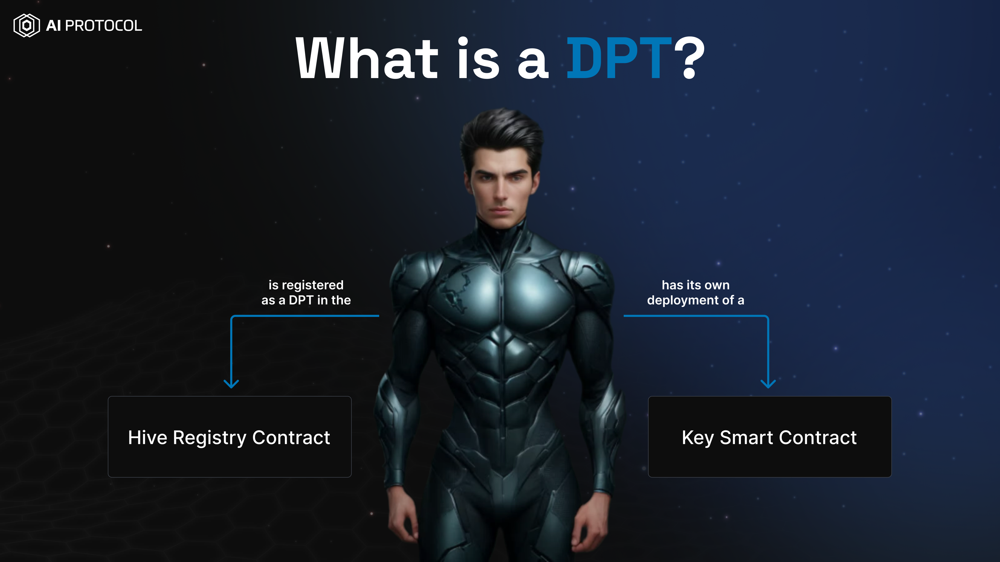
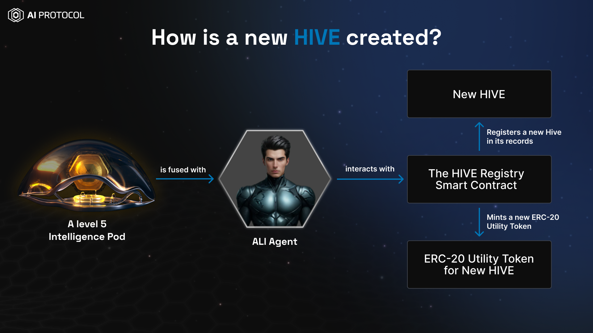
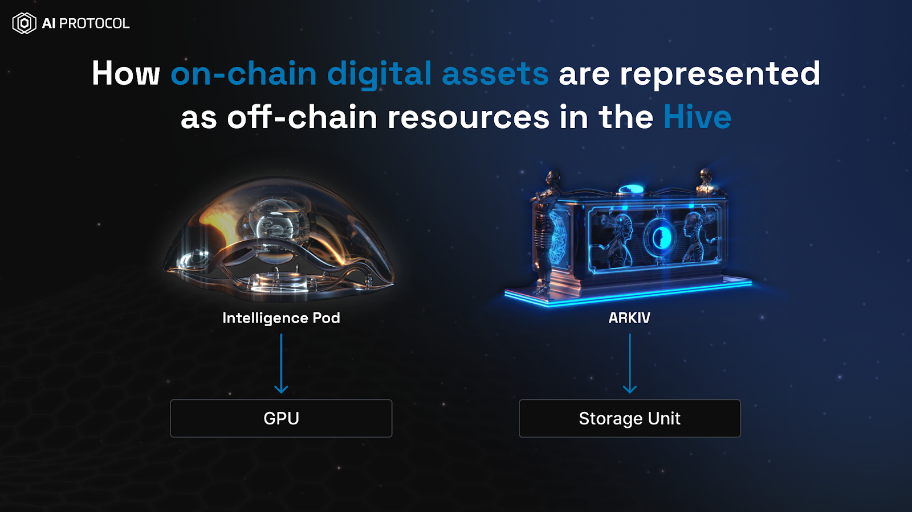

# Introduction
AI Protocol V3 enables the development of a community-driven, secure, and adaptive, decentralized physical
infrastructure (DePIN) for tokenized AI Systems.

The AI Protocol is composed of elements such as 
* [DPTs](#decentralized-pre-trained-transformers-dpt)
* [Hives](#hives)
* [Intelligence Pods](#intelligence-pod)
* [iNFT](#inft)

## Decentralized Pre-Trained Transformers (DPT)
A Decentralized Pre-Trained Transformer (DPT) is a tokenized AI system with specialized functionality and embedded
liquidity, offering a range of services. It can issue unique digital assets, termed "Keys", addressing the issue of low
liquidity in blockchain-based assets.

Any ERC721 Token (NFT) can be converted into a DPT using AI protocol smart contracts. To convert an ERC721 Token (NFT)
into a DPT you must own that NFT.

**I own an NFT how can I convert it into a DPT?**

Check out our guides to perform various operations with DPTs.

## How to
 
* [Convert an NFT into a DPT?](./guides/convert-nft-to-dpt/README.md)
* [Convert an iNFT into a DPT?](./guides/convert-inft-to-dpt/README.md)
* [Buy/Sell Keys of DPT](./guides/buy-sell-keys-of-dpt/buy-sell-keys-of-dpt.md)
* [Fuse a Level 5 Pod with a DPT?](./guides/fuse-pod-with-dpt/fuse-pod-with-dpt.md)
* [Launch Token for your DPT?](./guides/how-to-launch-utility-token/how-to-launch-token-dpt.md)
* [Create a Liquidity Pool on Uniswap for the Token of your DPT?](./guides/how-to-create-liquidity-pool-dpt.md)
* [Airdrop your DPT token](./guides/how-to-airdrop/how-to-airdrop.md)

## Hives
A Hive is an on-chain abstraction, allowing
* DPTs to have decentralized access to AI models, storage, GPUs and other resources.
* Resource providers to utilize their resources more effectively and transparently.
* Hive owners build economies around the Hives, and attract participants of the various kind.

This is achieved by enabling trustless coordination between various on-chain and off-chain components of the
AI Protocol.

From the technical point of view,
the Hive is a record in the `HiveRegistry` smart contract; the Hive:
1) is bound to one (and only one) AI Pod,
2) has one (and only one) ERC20 token enabling the Hive economy,
3) has one and only one hiveURI pointing to some off-chain resource with the information about the Hive
   (possibly a website),
4) has any number of NFTs (assets) bound to it (pre-sorted by category), and each NFT
   * has one (and only one) category within the Hive.
   * cannot join other hives (can only join 1 Hive at a time)
   * NFT which created a Hive cannot join the same Hive, or any other Hive.

Every Hive has the following components:
 * Native ERC-20 Utility Token
 * Hive Smart Contracts
 * Distributed Inference Cluster of GPUs
 * Distributed Storage Cluster
 * Tokenized Digital Assets
 * DPTs

Check out our guides to perform various operations with Hives

## How To

* [Launch a Utility Token for your Hive?](./guides/how-to-launch-utility-token/how-to-launch-utility-token.md)
* [Do an Airdrop for your Hive?](./guides/how-to-airdrop.md)
* [Create a Liquidity Pool on Uniswap for the Utility Token of your Hive?](./guides/how-to-create-liquidity-pool.md)
* [Create/Update/Join a Hive](./guides/how-to-hive.md)

## Intelligence Pod

Intelligence Pods emerge as pivotal assets within the AI Protocol ecosystem, serving as the foundational elements that bridge advanced AI capabilities with the decentralized digital asset space. These unique ERC-721 assets are at the core of enabling a myriad of functionalities, from the creation of intelligent NFTs (iNFTs) to the facilitation of decentralized computational resources, embodying a multifaceted utility that propels the ecosystem forward.

* **Facilitating Advanced AI Functionalities**
   
   At their essence, Intelligence Pods enable the transformation of standard NFTs into iNFTs, enriching them with AI-driven capabilities without altering their inherent properties or ownership. This transformation is achieved through a non-custodial process where an NFT is fused with an Intelligence Pod, allowing it to access and utilize generative AI models and systems within the AI Protocol's ecosystem. This seamless integration extends beyond mere enhancement, allowing NFTs to operate with advanced AI functionalities while retaining their original identity.

* **Decentralized Computational Contributions**

   The AI Protocol V3 introduces a revolutionary approach to decentralized computational resources, positioning Intelligence Pods as on-chain representations of off-chain compute power. By enabling individuals to contribute GPU resources or connect their Pods to Hives, Intelligence Pods facilitate access to distributed inference clusters and a broad spectrum of AI resources. This model not only democratizes access to computational resources but also empowers Pod holders to participate in the governance and allocation of these resources, further decentralizing the ecosystem's computational infrastructure.

* **Enhancing Ecosystem Dynamics through Hives**

   Intelligence Pods play a crucial role in the creation and expansion of Hives within the AI Protocol. Hives, powered by the innovative Hive Registry Contract, require a Level 5 Intelligence Pod for initiation, underscoring the Pods' significance in ecosystem growth. The process of creating a Hive, complete with its own ERC-20 utility token, fosters a vibrant and decentralized community by attracting both resource providers and consumers through incentives and utility token economics.

* **Utility and Accessibility Enhancements**

   The recent advancements in the AI Protocol have significantly enhanced the utility of Intelligence Pods, particularly through the introduction of the Level 5 Intelligence Level. This upgrade not only broadens the Pods' applicability across the ecosystem, including the ability to create Hive Liquidity Pools (LPs) but also makes it more accessible for users to upgrade their Pods. The reduction in ALI Tokens required for upgrades ensures more inclusive participation, enabling users to maximize the potential of their Intelligence Pods.

Check out our guides to perform various operations with Intelligence Pod

## How To

* [To acquire an Intelligence Pod?](./guides/intelligence-pod/how-to-acquire-an-ai-pod.md)
* [Upgrade the Intelligence Level of an Intelligence Pod?](./guides/intelligence-pod/how-to-upgrade-ai-pod.md)

## iNFT
The term iNFT is an abbreviation for intelligent Non-Fungible Token. In essence, an iNFT brings to life the underlying unique digital item of its NFT by using the generative powers of artificial intelligence.

As a simple analogy equates iNFTs to Humans with three parts:

* Body (ERC 721 that shows the image/PFP) 
* Soul (A Pod with Different Intelligence Levels) 
* Mind (As the Soul Matures in Intelligence Levels, the Mind is capable of Performing higher-order services that can be offered on the AI Protocol)

Any NFT can be turned into an iNFT via the iNFT Protocol. This is achieved by fusing the NFT with another ERC-721 asset called the Personality Pod. Once the NFT is fused with a Personality Pod, it acquires its own unique AI-powered personality.

## How to
* [Convert an iNFT into a DPT?](./guides/convert-inft-to-dpt/README.md)

## Governance

* [Role of ALI in governance, how to vote, how to discover which votes are underway, previously passed votes](./guides/governance.md)
* [Standardized errors, suggested errors to show for Hives](./guides/governance.md#governance-errors-)
