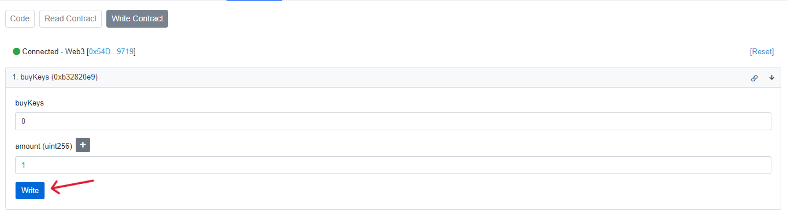

# How to Buy/Sell Keys of a DPT

# Prerequisites

* NFT details that are linked with DPT
* Enough ETH funds to buy keys and pay for gas.

### Buy Keys (via Basescan):

1. **Retrieve the Keys contract linked with DPT.**
    * Open https://basescan.org/address/0x63aCBC42e466d29F271c102Bf97A18B52203b308#readProxyContract#F27 and fill in the details for function 27. `lookupSharesContract`. Format
        ```
        _sharesSubject (tuple): ["collection_address","tokenId"] eg: ["0x303d1e1f43fef1fb8eab940d9c11a203281c5211","7"]
        ```
        > These values are the NFT collection address and tokenId that was used to create DPT

        

    * Click "Query" and your Keys contract address will be displayed.
        > This contract can be used to buy and sell keys of DPT. 

        
 
2. **Buy Keys**
    * Open the following link, but remember to replace `<paste-the-keys-address-here>` with the keys contract address: https://basescan.org/address/paste-the-keys-address-here#readContract#F10 and fill in the details for function 10. `getBuyPriceAfterFee`

    * Enter the amount of Keys you want to buy.

        

    * Click **Query** and it will display the price.
        > This is the amount of ETH required to buy those Keys.\
         **Copy this number somewhere we gonna need this in next step.**

        

    * Open the following link, and remember to replace `<paste-the-keys-address-here>` with the Keys contract address: https://basescan.org/address/paste-the-keys-address-here#writeContract#F1 and fill in the details for function 1. `buyKeys`
        ```
        payableAmount (ether): Paste the ETH amount that you copied earlier.
        amount (uint256): Amount of keys you want to buy.
        ```
        > Amount of keys you specify here must match the amount you queried price for.
    
        

    * Connect your wallet using **Connect to Web3** button. 

        

    * Click **Write** and approve the transaction in MetaMask.

        

    * Wait for the transaction to be confirmed. Congratulations you have bought keys of DPT

### Sell Keys (via Basescan):
1. **Get sell price**
    * Open the following link, and remember to replace `<past-the-keys-address-here>` with the keys contract address: https://basescan.org/address/paste-the-keys-address-here#readContract#F23 and fill in the details for function 21. `getSellPriceAfterFee`
        ```
        amount (uint256): Enter the amount of keys you want to sell
        ```

        
    
    * Click **Query** and it will display the price.
        > This is the amount of ETH you will receive if you sell this much of keys.

        

2. **Sell Keys**
    * Open the following link, and remember to replace `<past-the-keys-address-here>` with the keys contract address: https://basescan.org/address/paste-the-keys-address-here#writeContract#F7 and fill in the details for function 7. `sellKeys`
        ```
        amount (uint256): Enter the amount of keys you want to sell
        ```

        

    * Connect your wallet using **Connect to Web3** button.

         

    * Click **Write** and approve the transaction in MetaMask.

        

    * Wait for the transaction to be confirmed.