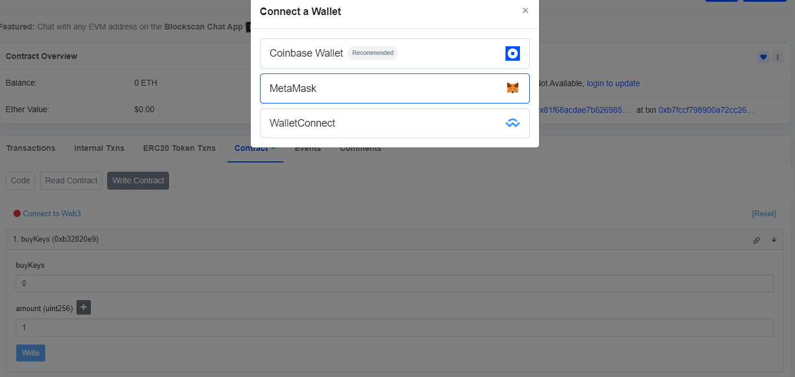

# How to Buy/Sell Keys of a DPT

# Prerequisites

* NFT details that are linked with DPT
* The Key price is in ALI token. So you would be required to have a sufficient amount of ALI tokens to buy the keys. [Buy ALI on Uniswap](https://app.uniswap.org/swap?chain=base&inputCurrency=ETH&outputCurrency=0x97c806e7665d3afd84a8fe1837921403d59f3dcc)
* Enough ETH to pay for gas.

### Buy Keys (via Basescan):

1. **Retrieve the Keys contract linked with DPT.**
    * Open https://basescan.org/address/0x80f5bcc38b18c0f0a18af3c6fba515c890689342#readProxyContract#F27 and fill in the details for function 27. `lookupSharesContract`. Format
        ```
        _sharesSubject (tuple): ["collection_address","tokenId"] eg: ["0x303d1e1f43fef1fb8eab940d9c11a203281c5211","7"]
        ```
        > These values are the NFT collection address and tokenId that was used to create DPT

        

    * Click "Query" and your Keys contract address will be displayed.
        > This contract can be used to buy and sell keys of DPT. 

        
 
2. **Buy Keys**
    * Open the following link, but remember to replace `<paste-the-keys-address-here>` with the keys contract address: https://basescan.org/address/paste-the-keys-address-here#readContract#F10 and fill in the details for function 10. `getBuyPriceAfterFee`

    * Enter the amount of Keys you want to buy.

        

    * Click **Query** and it will display the price.
        > This is the amount of ALI required to buy those Keys.\
         **Copy this number somewhere we will be going need this in next step.**

        
    
    * Open the following link, to approve ALI tokens.
    https://basescan.org/token/0x97c806e7665d3afd84a8fe1837921403d59f3dcc#writeContract#F1 
    Fill in the details for function 1. `approve`
        ```
        spender: Paste the keys contract address here.
        value: Paste the ALI amount that you copied earlier.
        ```
        
    
    * Connect your wallet using **Connect to Web3** button.

        

    * Click **Write** and approve the transaction in Metamask.

         

    * Wait for the transaction to be confirmed by the blockchain.

    * Open the following link, and remember to replace `<paste-the-keys-address-here>` with the Keys contract address: https://basescan.org/address/paste-the-keys-address-here#writeContract#F1 and fill in the details for function 1. `buyKeys`
        ```
        payableAmount (ether): This will be 0 as the keys price is being paid in ALI.
        amount (uint256): Amount of keys you want to buy.
        ```
        > Amount of keys you specify here must match the amount you queried price for.
    
        

    * Connect your wallet using **Connect to Web3** button. 

        

    * Click **Write** and approve the transaction in MetaMask.

        

    * Wait for the transaction to be confirmed. Congratulations you have bought keys of DPT

### Sell Keys (via Basescan):
1. **Get sell price**
    * Open the following link, and remember to replace `<past-the-keys-address-here>` with the keys contract address: https://basescan.org/address/paste-the-keys-address-here#readContract#F23 and fill in the details for function 21. `getSellPriceAfterFee`
        ```
        amount (uint256): Enter the amount of keys you want to sell
        ```

        
    
    * Click **Query** and it will display the price.
        > This is the amount of ALI you will receive if you sell this much of keys.

        

2. **Sell Keys**
    * Open the following link, and remember to replace `<past-the-keys-address-here>` with the keys contract address: https://basescan.org/address/paste-the-keys-address-here#writeContract#F7 and fill in the details for function 7. `sellKeys`
        ```
        amount (uint256): Enter the amount of keys you want to sell
        ```

        

    * Connect your wallet using **Connect to Web3** button.

         

    * Click **Write** and approve the transaction in MetaMask.

        

    * Wait for the transaction to be confirmed.