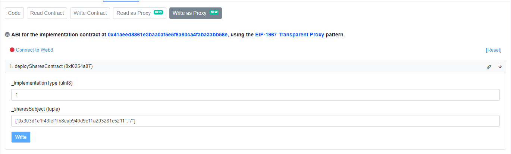
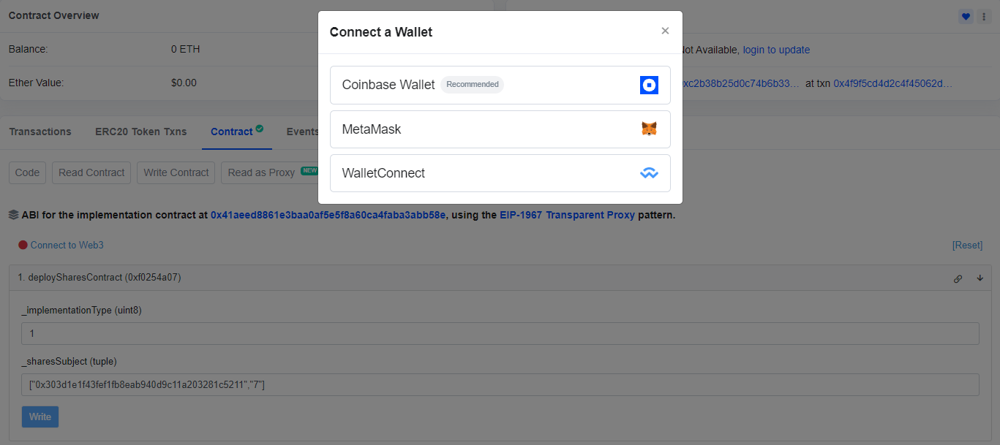
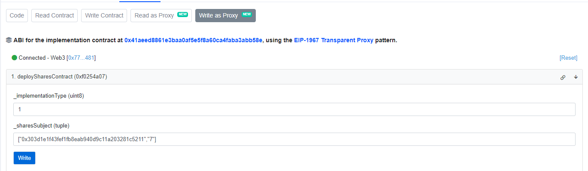
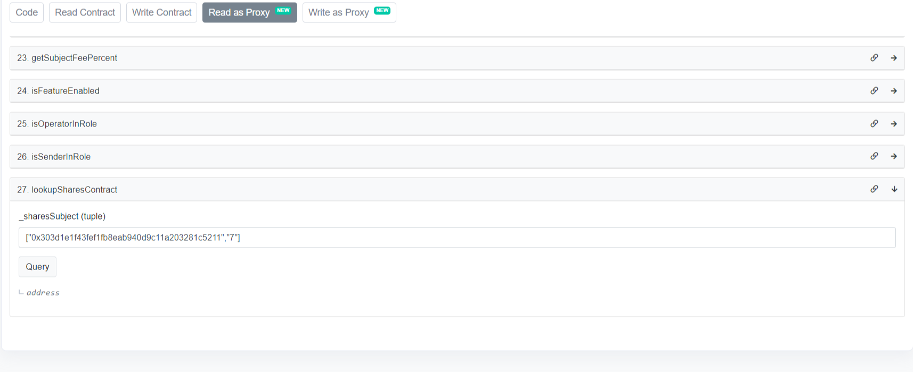

# How can I convert my NFT into an ALI Agent?
Any ERC721 Token (NFT) can be converted into an ALI Agent using AI Protocol smart contracts. To do so you must have ownership of that NFT

# Instructions
## Option 1: Using Basescan

1. Open https://basescan.org/address/0x63aCBC42e466d29F271c102Bf97A18B52203b308#writeProxyContract#F1 and fill in the details for function 1. `deploySharesContract`. Format:
    ```
    _implementationType (uint8): 0 (This will be zero for every ALI Agent)
    _sharesSubject (tuple): ["collection_address","tokenId"] eg: ["0x303d1e1f43fef1fb8eab940d9c11a203281c5211","7"]
    ```
    
    

2. Connect your wallet using **Connect to Web3** button

    

3. Click "Write" and approve the transaction in MetaMask

    

4. Retrieve the keys contract that is being deployed against your NFT.
5. Open https://basescan.org/address/0x63aCBC42e466d29F271c102Bf97A18B52203b308#readProxyContract#F27 and fill in the details for function 27. `lookupSharesContract`. Format
    ```
    _sharesSubject (tuple): ["collection_address","tokenId"] eg: ["0x303d1e1f43fef1fb8eab940d9c11a203281c5211","7"]
    ```
    > These values needs to be same as you used for the first step.

    

6. Click "Query" and your keys contract address will be displayed.
    > This keys contract holds the embeded liquidty for you ALI Agent. This contract can be used to buy and sell keys of your ALI Agent.

    

## Option 2: Using Nodejs
## Setup the repo locally
```bash
# Clone the repo
git clone https://github.com/AI-Protocol-Official/Documentation.git

# Move to working directory
cd guides/convert-nft-to-ali-agent

# Install dependencies
npm install
```

## Setup the environment variables

```bash
# Create a environment variables file
cp .env.example .env

# Open .env file in a editor and add the following variables

PRIVATE_KEY="your wallet private key which owns the NFT"

RPC_URL="rpc url of base network"

# Add your NFT details

NFT_COLLECTION_ADDRESS="NFT collection address in which you own the NFT"

# The wallet you previously specified must own this NFT

NFT_TOKEN_ID="NFT token id"
```


## Deploy your ALI Agent

```bash
# Now that we all setup. Run this to convert your NFT into ALI Agent
npm run deploy
```

Hurray you have just created a ALI Agent with your NFT 🥳