# How to fuse a Level 5 Pod with a DPT?

AI Pod or Intelligence Pod, (previously known as a Personality Pod) within the AI Protocol, is an essential ERC-721 Asset. It plays a crucial role in the formation of a DPT [Learn more]()

## Prerequisites
1. You must own a Level 5 AI Pod aka Intelligence Pod.
2. You must own a DPT.
3. Keep in mind that your pod will be locked.
4. **If you attempt to fuse the Pod with a DPT that you do not own, you risk losing your Pod.**

## Instructions using Etherscan

1. Open https://etherscan.io/address/0xDd70AF84BA86F29bf437756B655110D134b5651C#writeContract#F1 and fill in the details for function 1. `approve`. Format:
    ```
    _approved (address): 0xb9f02fc926b2ab66cadd6ea1ee90fb0d8698790b (This address will be same)
    _tokenId (uint256): 538 (Your pod id)
    ```

    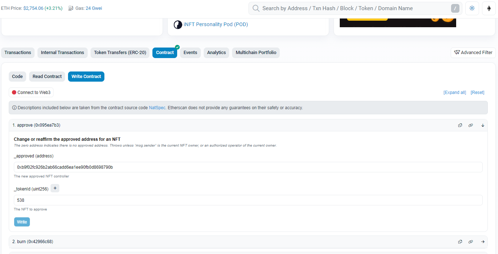

2. Connect your wallet using **Connect to Web3** button

    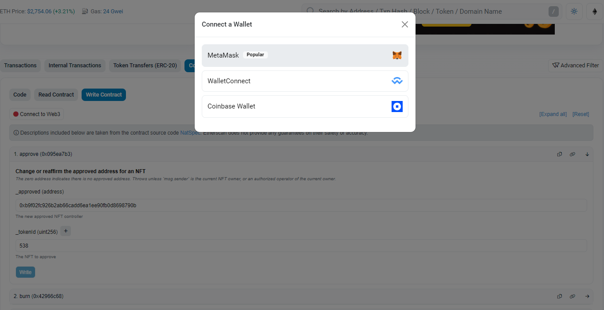

3. Click **Write** and approve the transaction in MetaMask

    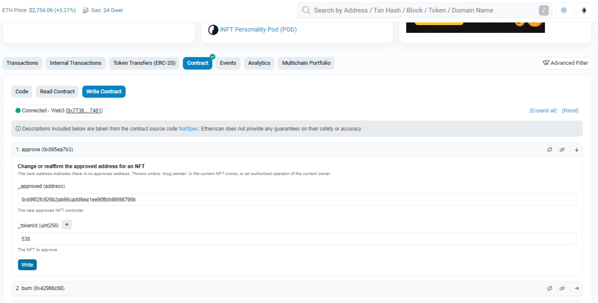

4. Before moving to the next step. Wait for the transaction to be confirmed.

5. Open https://etherscan.io/address/0xb9f02fc926b2ab66cadd6ea1ee90fb0d8698790b#writeProxyContract#F2 and
    fill in the details for function 2. `link`. Format:
     ```
    personalityId (uint96): 538 (Your pod id)
    targetContract (address): 0xce69a87c02baa8c5f17ed7eb8b1c2657afc2e1af (NFT collection address)
    targetId (uint256): 2283 (NFT id)
    ```

    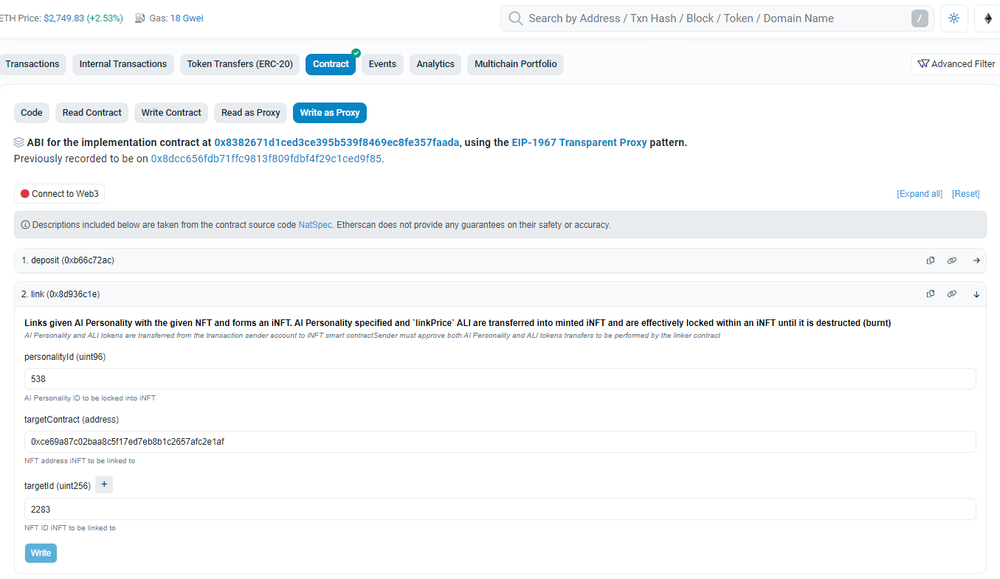

6. Connect your wallet using **Connect to Web3** button

    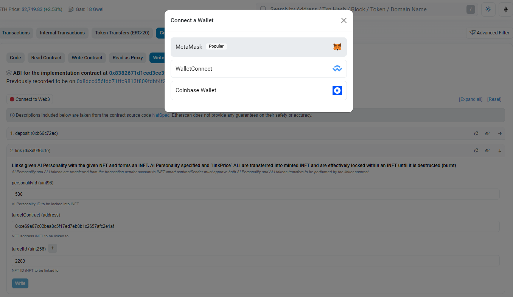

7. Click "Write" and approve the transaction in MetaMask

    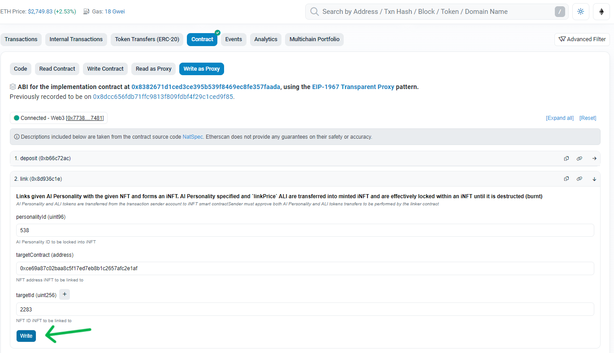

8. Wait for the transaction to be confirmed. Congratulations your Pod is being fused with your DPT

## Instructions using Noah's Ark

1. Click Login / Signup to proceed

    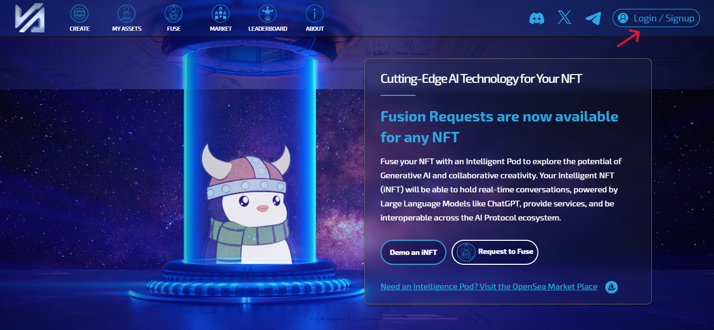

2. Sign In or Sign Up using your email

    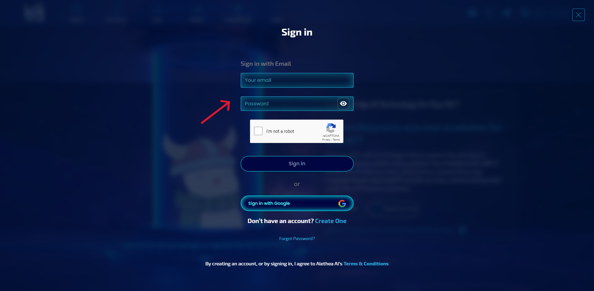

3. Click on the FUSE menu icon

    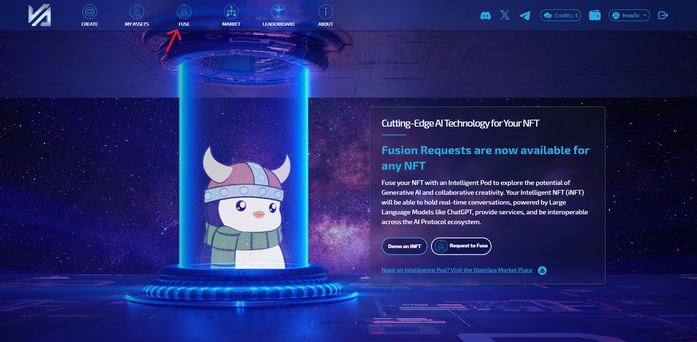

4. Connect your wallet

    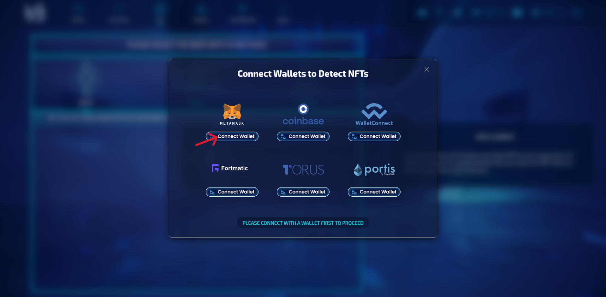

5. Approve the wallet connection request in Metamask

    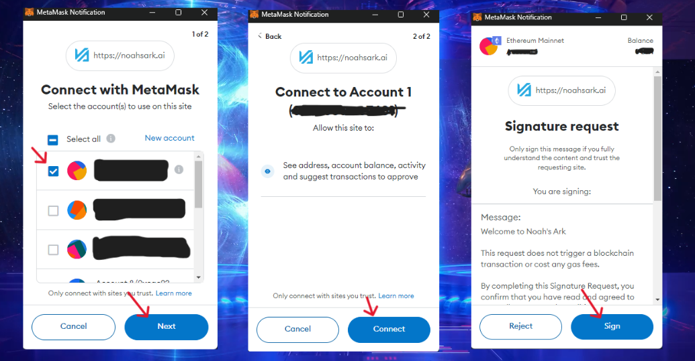

6. Select the NFT Body

     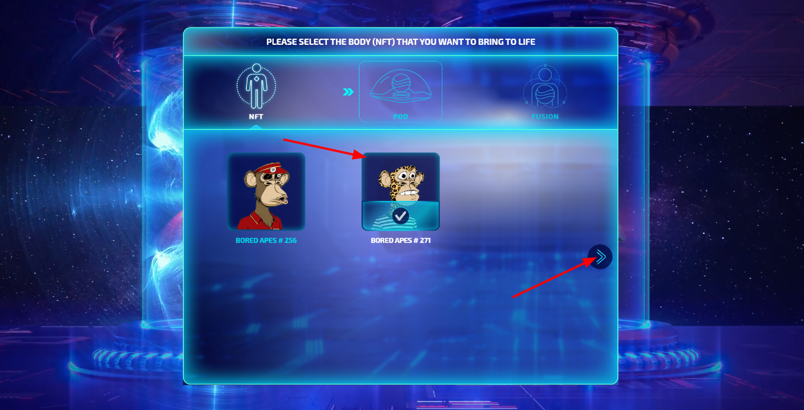

7. Select the Intelligence Pod

    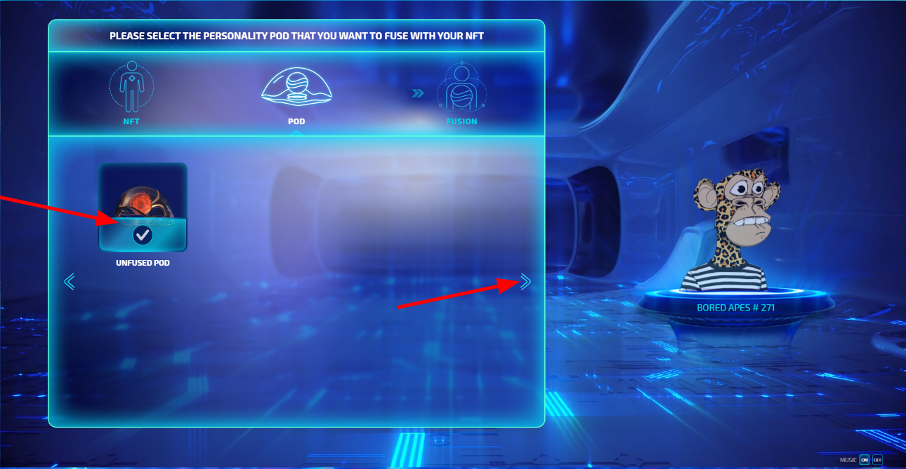

8. Clicking FUSE will take you to disclaimers and transactions to sign in wallet.
    > You will see your Pod and NFT, with a disclamer on the right.

    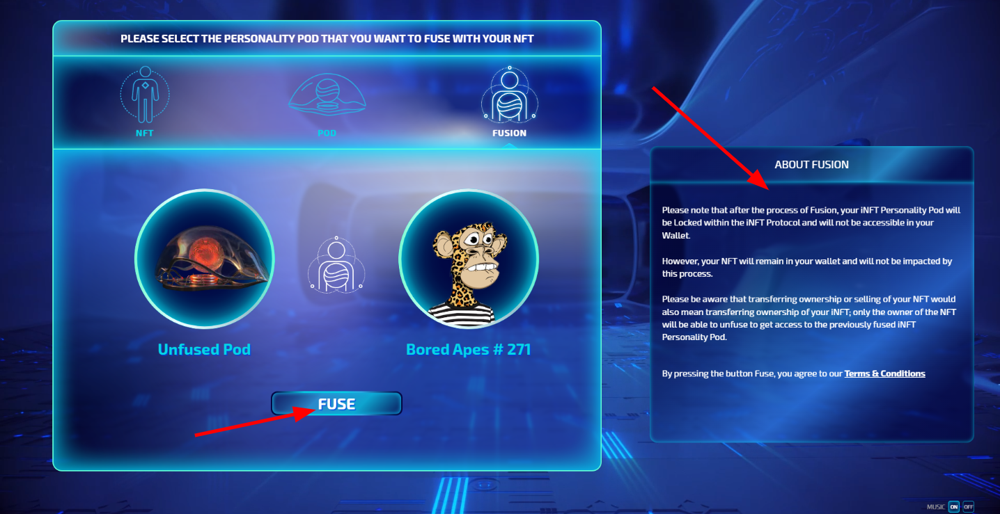

9. Read the description of Fusion carefully and Confirm or Close this screen.

    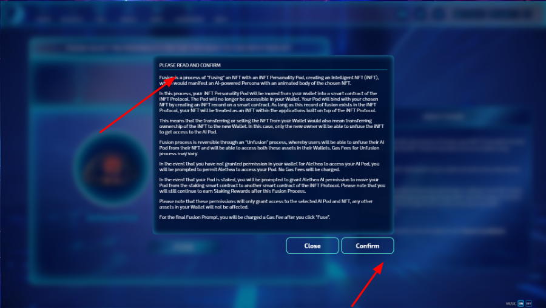

10. Click FUSE to begin transaction Signing.
    > If your Pod is staked, you will get 3 transactions to confirm.\
    If your Pod is not staked, you will 2 transactions to confirm.

    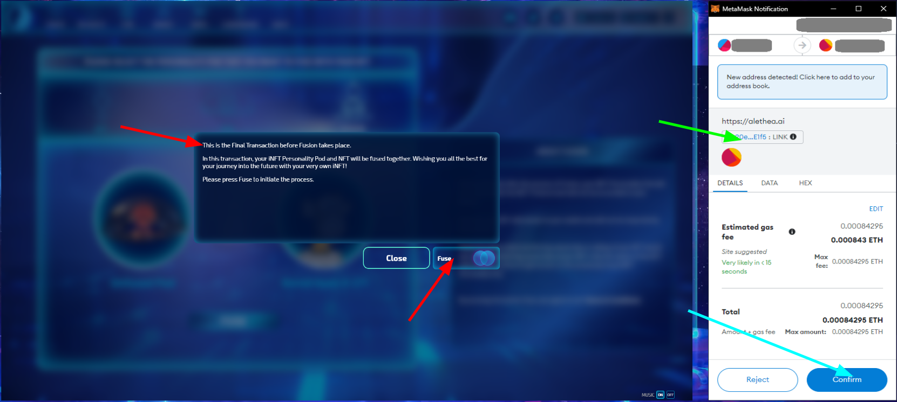

11. FUSION Success!
    > When Fusion is complete you will see an animation of your Intelligence Pod being transferred into your DPT.

    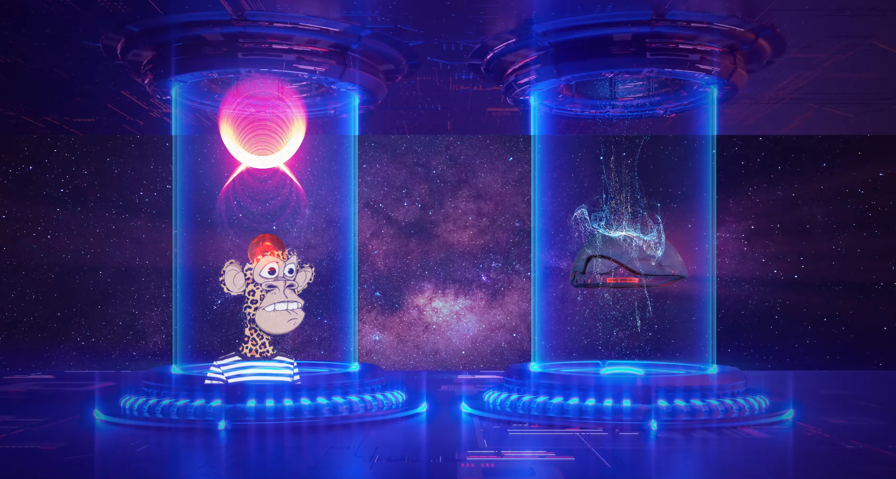