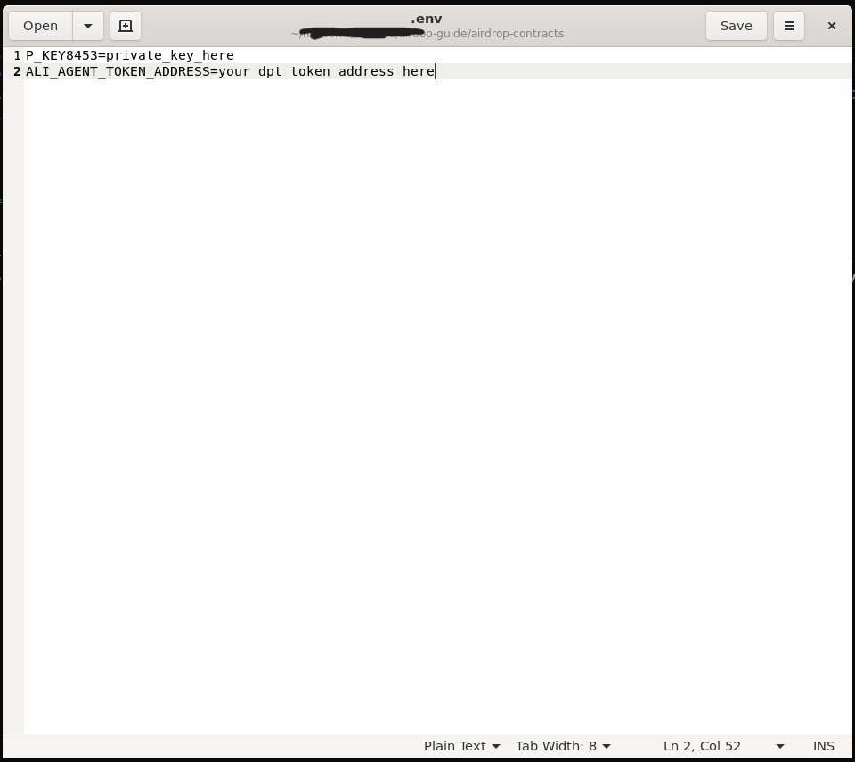
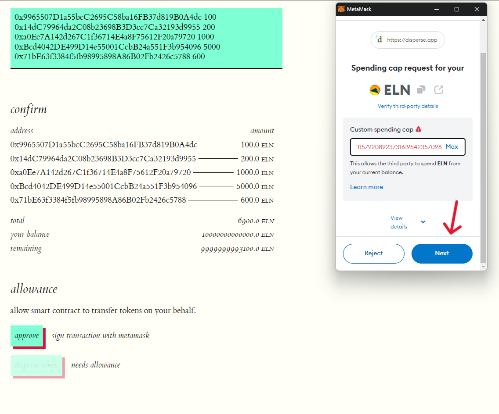
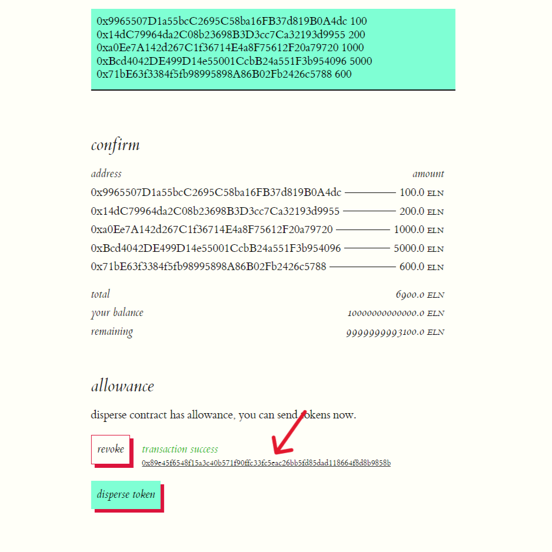

# How to Airdrop your DPT token

## Prerequisites

1.  A deployed ERC20 token and the required balance of that token for the airdrop.
2.  A list of the addresses and their corresponding airdrop balances, which should sum up to a value not exceeding the available airdrop balance.

For example, let's say the ERC20 token address is `0x59b670e9fA9D0A427751Af201D676719a970857b` and the required airdrop balance is `6,900` (six thousand nine hundred).

Let the list of the addresses for an airdrop and their balances be:

| Airdrop Address                            | Airdrop Value |
|--------------------------------------------|---------------|
| 0x9965507D1a55bcC2695C58ba16FB37d819B0A4dc | 100           |
| 0x976EA74026E726554dB657fA54763abd0C3a0aa9 | 200           |
| 0x14dC79964da2C08b23698B3D3cc7Ca32193d9955 | 1,000         |
| 0x23618e81E3f5cdF7f54C3d65f7FBc0aBf5B21E8f | 5,000         |
| 0xa0Ee7A142d267C1f36714E4a8F75612F20a79720 | 600           |
| Total:                                     | 6,900         |

Replace the addresses (including token address) and values above with your relevant values

## Option 1: Using AI Protocol's Airdrop Smart contracts

### Prerequisites
1. Git must be installed on your machine.
2. Node.js 18 must be installed on your machine.

In this guide, you will deploy an airdrop smart contract to distribute your DPT tokens among users.

#### Step 1: Setup the Repository

1. Open your terminal and clone the repository that contains the contracts by typing `git clone git@github.com:AI-Protocol-Official/airdrop-contracts.git`.

    

2. Navigate to the contracts directory using `cd airdrop-contracts`.

    

3. Install the dependencies by running `npm install`.

    

    

#### Step 2: Deploy the Contract

1. Before deploying the contracts, you need to set a few environment variables.

2. Create a file named `.env` using the command `touch .env`.

    

3. Open the `.env` file in any text editor.

4. In this file, you need to add two values:
    1. `P_KEY8453`: This should be the private key of the account that has sufficient funds to deploy the contract. This account will be the owner of the contract.
    2. `DPT_TOKEN_ADDRESS`: This should be the address of the DPT token that you want to link with the airdrop contract. **The airdrop contract will only distribute this token among users**.

    

5. After adding the values, save the file.

6. To deploy the contract, run `npx hardhat deploy --network base_mainnet`.

7. Once the contract is deployed, the address will be printed in the console.
    > This contract address will be used by users to claim their airdrops. More about claiming is in step 6.

    

#### Step 3: Generate Merkle Tree
A Merkle tree is a cryptographic technique used in this airdrop contract to reduce gas costs. In this step, we will generate a Merkle tree from the list of users to whom we want to distribute the airdrop.

1. Open the file `WorkDirectory/scripts/merkle_tree/data.csv` in a text editor.

2.  Add the details of the airdrop users. The details should be comma-separated.

    

3. Save the file and close the editor.

4. Run `npx hardhat run ./scripts/merkle_tree/generate_merkle_tree.js` to generate the Merkle tree.
    > This command generates the Merkle tree and stores the data in `WorkDirectory/scripts/merkle_tree/merkle_tree.json`

    

5. This generated file will contain a root and a rewardList, which is an array of airdropped users.

6. In the rewardList array, there is a proof attached to each airdrop user. This proof will be required by the user to claim their airdrop from the smart contract.

    

#### Step 4: Update the Root on the Smart Contract and Transfer tokens
The root is a cryptographic hash obtained by hashing all the airdrop users along with their amounts. Each time you update the list of airdrop users, the root also gets updated. To let the smart contract know that the list of airdrop users has been updated, you have to update the root on the smart contract. Here's how to do it automatically using the provided script:

1. Run `npx hardhat run ./scripts/update_merkle_root.js --network base_mainnet` in the terminal.
    > This command automatically fetches the root from the `merkle_tree.json` file and sends a transaction to update the root on the airdrop smart contract.

    

2. After you update the root on the smart contract, you need to transfer the total no of airdroped tokens to the smart contract. So that users can claim the tokens from the smart contract.

3. To do so you can copy the address of the airdrop smart contract. It was at the end of Step 2. And send DPT tokens to it from your Metamask. 

#### Step 5: Remove the Private Key

1. Run `rm .env` to delete the `.env` file. Since it contains your private key and we are done with the process, it's not secure to keep this file.
    
    

#### Step 6: Claim Airdrop tokens

1. Open the airdrop contract on BaseScan. You can do this by following the link, but remember to replace `<paste-the-airdrop-contract-address-here>` with the airdrop contract address: https://basescan.org/address/paste-the-airdrop-contract-address-here#writeProxyContract#F1 and fill in the details for function 2, `link`. The format is as follows:
     ```
    _to (address): user address exist in the merkle tree file
    _totalReward (uint256): total airdropped tokens, can be found in the merkle tree file
    _proof (bytes32[]): proof array, will be associated with address in the merkle tree file.
    ```

    

2. Connect your wallet using **Connect Wallet** button

    

3. Click on **write** to send the claim transaction.
    > Upon confirmation of the transaction on the blockchain, the airdrop token amount will be transferred to the `_to` address.

    

## Option 2: Push via Disperse APP GUI

1. Open the disperse.app https://disperse.app/

2. Connect your wallet and select the base network.

    

3. Once the wallet is connected and your selected network is Base. Select the `token` button since we want to airdrop tokens.

    

4. Selecting the token button will show an input where you can paste your DPT token address.

    

5. After you put the token address in the input, click on the `load` button to load the token details.

    

6. Token details will be fetched and will be shown along with an input to add address details for the airdrop.

    

7. Here, you have to enter the addresses you want to airdrop along with the amount for each address.

    
    > You can confirm the addresses with amount being airdroped in the confirm section.

8. Once you have confirmed the details, click on `approve` to provide allowance to the smart contract. This allows it to transfer tokens on your behalf.

    

7. Click `Next` on your Metamask popup to allow the spending cap. 

    

9. Click `Approve` on your Metamask popup to send the approve transaction. 

    

10. Once the approve transaction is confirmed by the blockchain, you will see the transaction success message along with the transaction hash.

    

11. Click on the `disperse token` button and confirm the transaction on the Metamask popup to airdrop the tokens among users.

    

12. Once the airdrop transaction is confirmed by the blockchain, you will see a success message along with the transaction hash.

    
    >You can click on the transaction hash to see it on Basescan.


13. Congratulations! You have successfully airdropped your DPT's tokens.