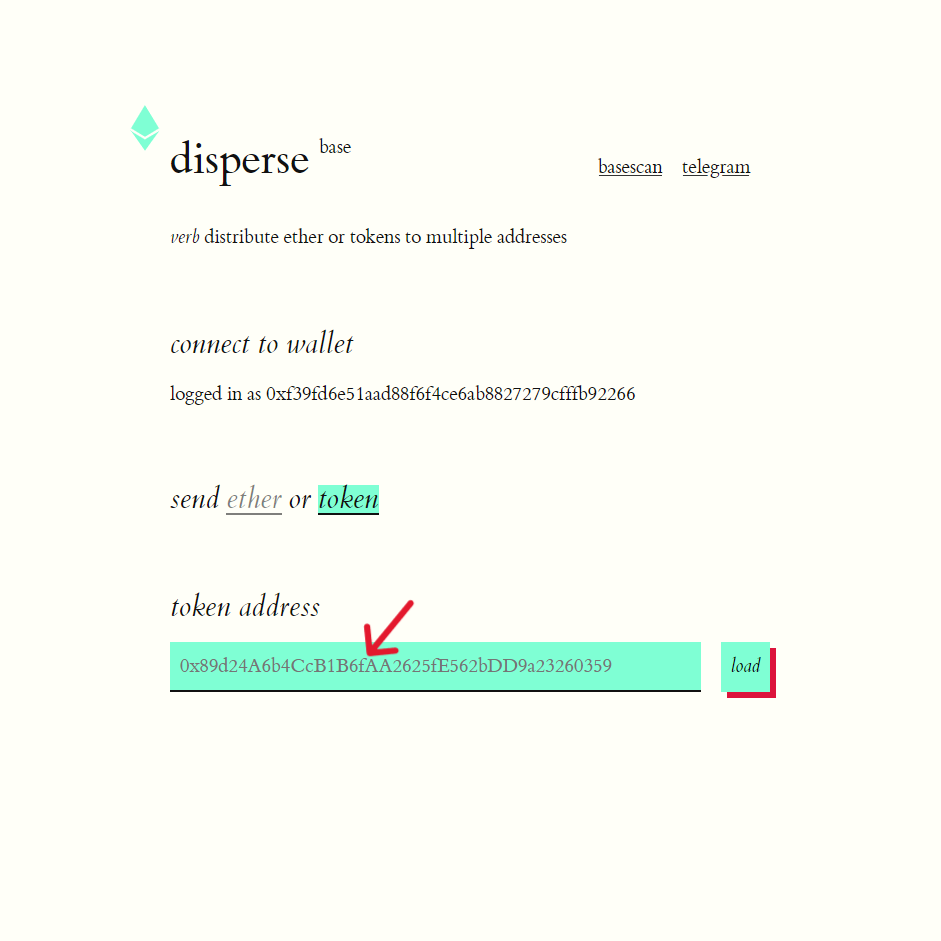
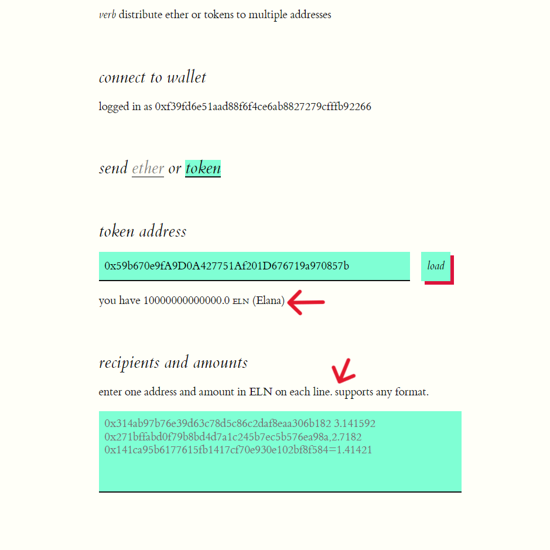
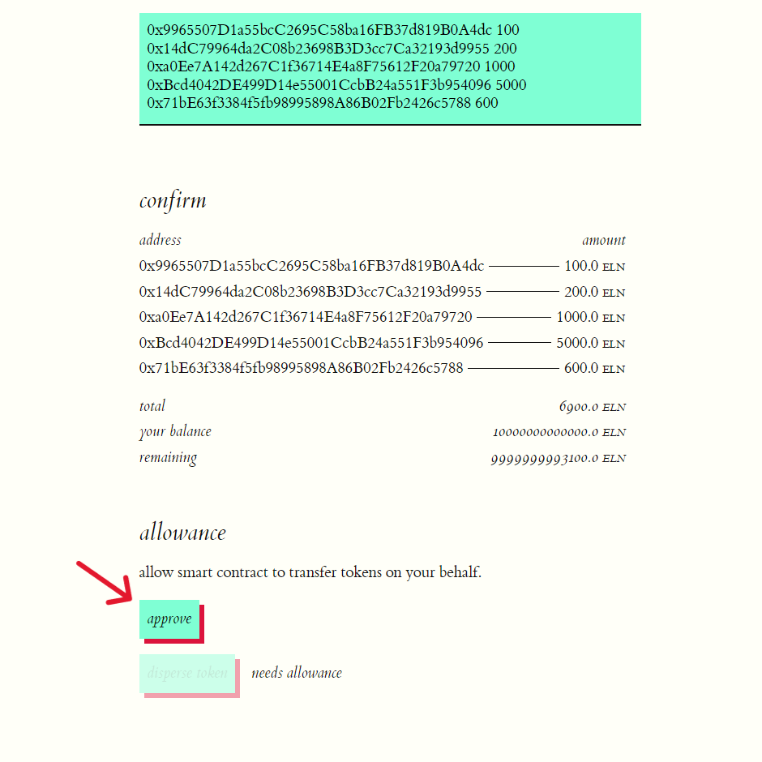
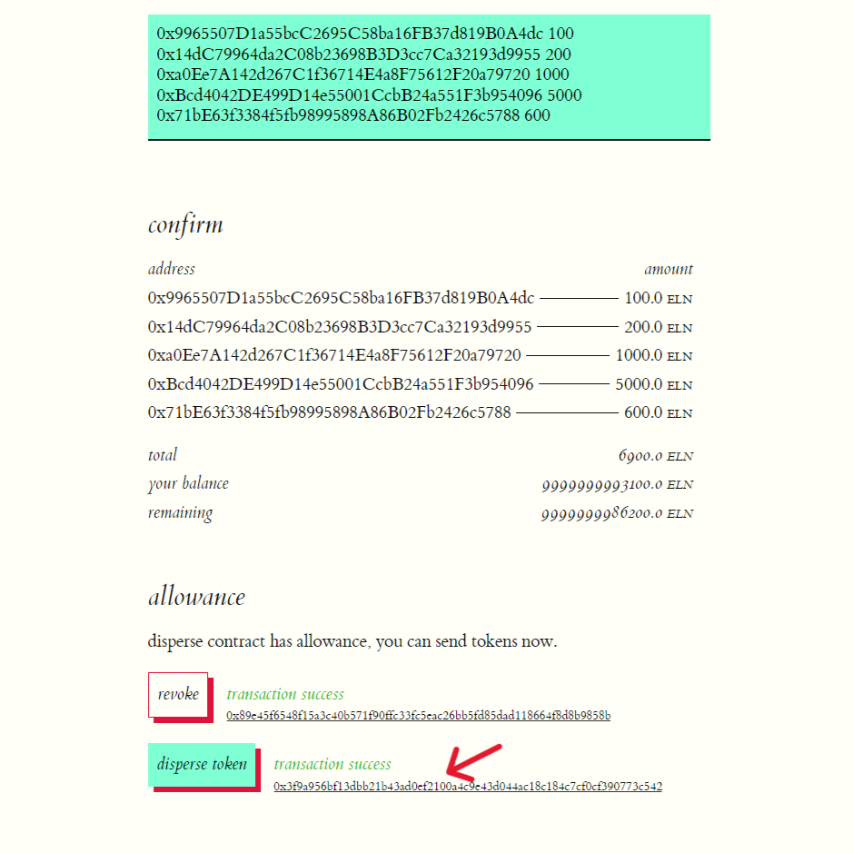

# How to Airdrop your DPT token

## Prerequisites

1.  A deployed ERC20 token and the required balance of that token for the airdrop.
2.  A list of the addresses and their corresponding airdrop balances, which should sum up to a value not exceeding the available airdrop balance.

For example, let's say the ERC20 token address is `0x59b670e9fA9D0A427751Af201D676719a970857b` and the required airdrop balance is `6,900` (six thousand nine hundred).

Let the list of the addresses for an airdrop and their balances be:

| Airdrop Address                            | Airdrop Value |
|--------------------------------------------|---------------|
| 0x9965507D1a55bcC2695C58ba16FB37d819B0A4dc | 100           |
| 0x976EA74026E726554dB657fA54763abd0C3a0aa9 | 200           |
| 0x14dC79964da2C08b23698B3D3cc7Ca32193d9955 | 1,000         |
| 0x23618e81E3f5cdF7f54C3d65f7FBc0aBf5B21E8f | 5,000         |
| 0xa0Ee7A142d267C1f36714E4a8F75612F20a79720 | 600           |
| Total:                                     | 6,900         |

Replace the addresses (including token address) and values above with your relevant values

## Option 1: Push via Disperse APP GUI

1. Open the disperse.app https://disperse.app/

2. Connect your wallet and select the base network.

    

3. Once the wallet is connected and your selected network is Base. Select the `token` button since we want to airdrop tokens.

    

4. Selecting the token button will show an input where you can paste your DPT token address.

    

5. After you put the token address in the input, click on the `load` button to load the token details.

    

6. Token details will be fetched and will be shown along with an input to add address details for the airdrop.

    

7. Here, you have to enter the addresses you want to airdrop along with the amount for each address.

    
    > You can confirm the addresses with amount being airdroped in the confirm section.

8. Once you have confirmed the details, click on `approve` to provide allowance to the smart contract. This allows it to transfer tokens on your behalf.

    

7. Click `Next` on your Metamask popup to allow the spending cap. 

    

9. Click `Approve` on your Metamask popup to send the approve transaction. 

    

10. Once the approve transaction is confirmed by the blockchain, you will see the transaction success message along with the transaction hash.

    

11. Click on the `disperse token` button and confirm the transaction on the Metamask popup to airdrop the tokens among users.

    

12. Once the airdrop transaction is confirmed by the blockchain, you will see a success message along with the transaction hash.

    
    >You can click on the transaction hash to see it on Basescan.

13. Congratulations! You have successfully airdropped your DPT's tokens.