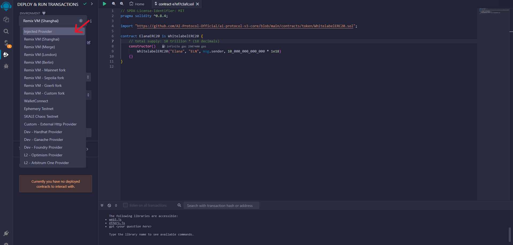
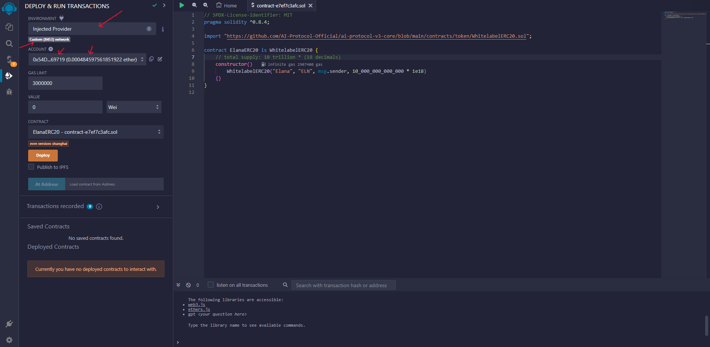

# How to launch a Token for your DPT?

## Prerequisites
1. **Understanding of Tokenomics**: It's crucial to have a solid understanding of [tokenomics](./dpt-tokenomics.md), which is the study of the economic systems surrounding blockchain tokens.
2. **Metamask Wallet**: Ensure you have a Metamask wallet set up with sufficient funds to cover gas fees for token creation and transactions.
3. Your token should be compliant with ERC20, ERC1363, EIP2612, and EIP3009 Standards.

## Instructions using Remix
**These instructions include our implementation of ERC20 which fulfills all standards mentioned above**

*    Open <a href="https://remix.ethereum.org/?#code=Ly8gU1BEWC1MaWNlbnNlLUlkZW50aWZpZXI6IE1JVApwcmFnbWEgc29saWRpdHkgXjAuOC40OwoKaW1wb3J0ICJodHRwczovL2dpdGh1Yi5jb20vQUktUHJvdG9jb2wtT2ZmaWNpYWwvYWktcHJvdG9jb2wtdjMtY29yZS9ibG9iL21haW4vY29udHJhY3RzL3Rva2VuL1doaXRlbGFiZWxFUkMyMC5zb2wiOwoKY29udHJhY3QgVG9rZW5OYW1lRVJDMjAgaXMgV2hpdGVsYWJlbEVSQzIwIHsKICAgIC8vIHRvdGFsIHN1cHBseTogMSB0cmlsbGlvbiAqICgxOCBkZWNpbWFscykKICAgIGNvbnN0cnVjdG9yKCkKICAgICAgICBXaGl0ZWxhYmVsRVJDMjAoIlRva2VuTmFtZSIsICJUb2tlblN5bWJvbCIsIG1zZy5zZW5kZXIsIDFfMDAwXzAwMF8wMDBfMDAwICogMWUxOCkKICAgIHt9Cn0K&optimize=true&runs=200" target="_blank">Code in remix</a>

* Once you open the above link you will have a screen with a contract similar to the attached image.

    

* We will be changing `TokenNameERC20`, `TokenName`, `TokenSymbol`, and `totalSupply` to personalize it according to our DPT tokenomics. 
    > By now it is assumed that you have already read the [tokenomics](./dpt-tokenomics.md) guide

    
* For this example, we have a DPT named **Elana** and want to create a token for it.
Our tokenomics for the token is as follows:
    >**TokenName:** Elana\
    **TokenSymbol:** ELN\
    **totalSupply:** 10 Trillion
* Change the above-mentioned items in the contract

    
    > As you can see, we have changed the following items\
    `TokenNameERC20` to `ElanaERC20`\
    `TokenName` to `Elana`\
    `TokenSymbol` to `ELN`\
    `totalSupply` from `1_000_000_000_000` to `10_000_000_000_000` to make it 10 Trillion

* Compile the contract.

    

* Navigate to `Deploy and run transactions` from the left navigation.

    

* Change the environment from Remix VM to Injected Provider. And connect your Metamask.

    

* Once your Metamask is connected, verify the following items. 
    
    

    1. Injected Provider is selected
    2. Your chainId is 8453 (Base). If not, switching the chain from your Metamask account will change the chain. **This is the chain the token will be deployed on**
    3. Your account address is correct which you want to use for token deployment. 
    4. Your account has sufficient balance to pay for the token deployment transaction

* Select the token contract to deploy.

    
    > You have to select your token contract name that you selected earlier.\
    Like in this case we will chose ElanaERC20

* Click on **Deploy** and it will show the Metamask popup for deployment.

    

* Note a few things before confirming the transaction in Metamask.

    
    >Your network is Base\
    The transaction specifies `New Contract` and `CONTRACT DEPLOYMENT`

* Confirm the transaction in Metamask.

* After you’ve initiated the token deployment, wait for the transaction to be confirmed on the blockchain.

* Once the transaction is confirmed, it’s time to retrieve your token address.

*  You can find the token address in the `Deployed Contracts` section, which is located on the left panel of the Remix interface

    

* **Note:** At this point, your token is being deployed but will not function as expected. As we require to do one more transaction to enable all the features of this token.

* To do so please expand the contract functions using the expand button.

    

* Locate the function named `updateFeatures`

    

* Put the mask value `65535` and do the update transaction with `transact` button.

    
    >Value other than `65535` will not enable the correct features. So please be careful.

* Confirm the transaction in Metamask.

    

* After you’ve initiated the update feature transaction, wait for the transaction to be confirmed on the blockchain.
    > Once the transaction is confirmed. All token features including `transfer` `transferFrom` will be enabled.

* Import this token into your Metamask wallet.

* Congratulations! You have successfully deployed an ERC20 token for your DPT.

* Making decisions about how to distribute your token, what kinds of unique functions work for your community, and other considerations can be found in our DPT [Tokenomics guide](./dpt-tokenomics.md).