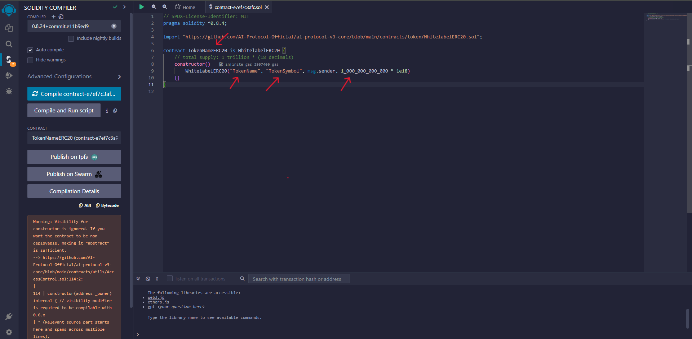
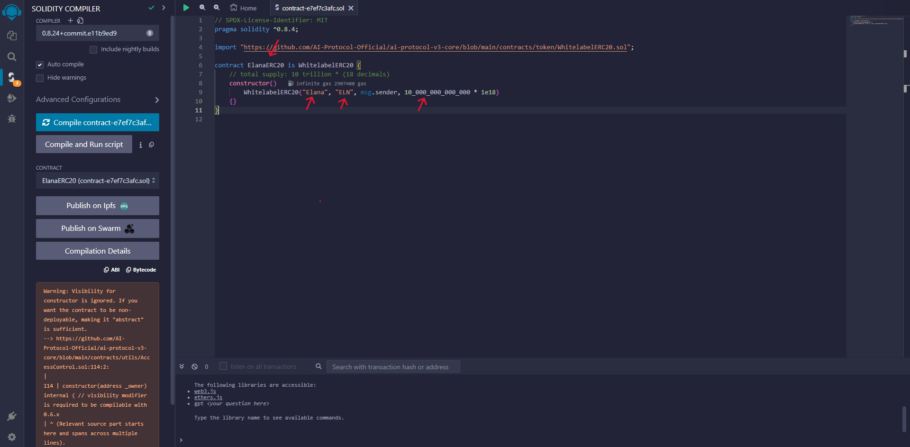
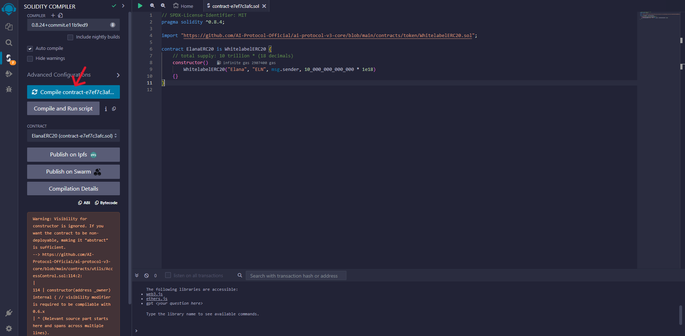
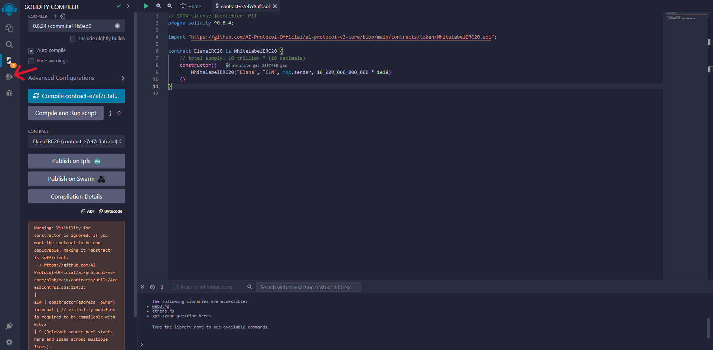
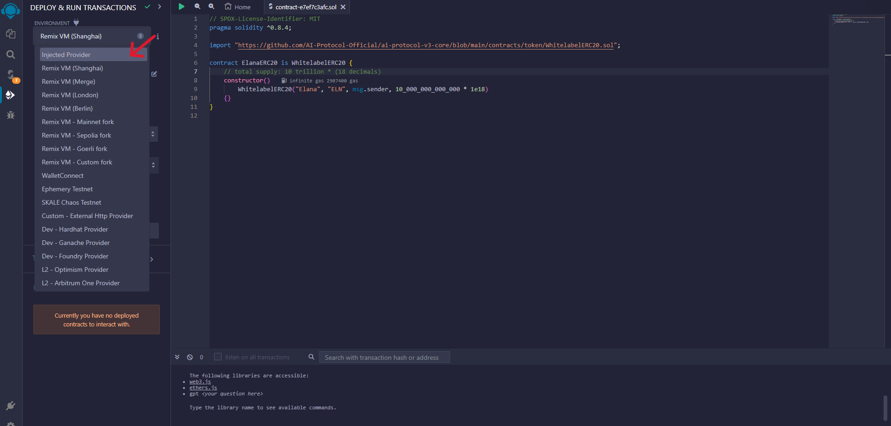
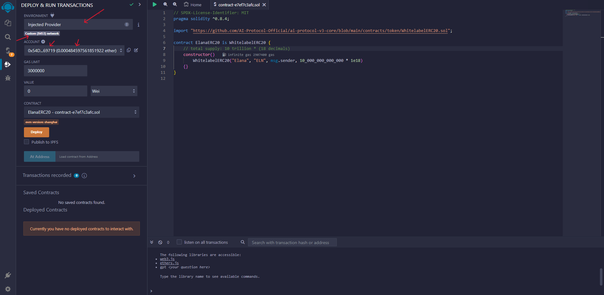

# How to launch a Utility Token for your DPT?

## Prerequisites
1. Your token should be compliant with ERC20, ERC1363, EIP2612, and EIP3009 Standards.

## Instructions using Remix
**These instructions include our implementation of ERC20 which fulfills all standards mentioned above**

1. Open [Code in remix](https://remix.ethereum.org/?#code=Ly8gU1BEWC1MaWNlbnNlLUlkZW50aWZpZXI6IE1JVApwcmFnbWEgc29saWRpdHkgXjAuOC40OwoKaW1wb3J0ICJodHRwczovL2dpdGh1Yi5jb20vQUktUHJvdG9jb2wtT2ZmaWNpYWwvYWktcHJvdG9jb2wtdjMtY29yZS9ibG9iL21haW4vY29udHJhY3RzL3Rva2VuL1doaXRlbGFiZWxFUkMyMC5zb2wiOwoKY29udHJhY3QgVG9rZW5OYW1lRVJDMjAgaXMgV2hpdGVsYWJlbEVSQzIwIHsKICAgIC8vIHRvdGFsIHN1cHBseTogMSB0cmlsbGlvbiAoMTBeMTIgKyAxOCBkZWNpbWFscykKICAgIGNvbnN0cnVjdG9yKCkKICAgICAgICBXaGl0ZWxhYmVsRVJDMjAoIlRva2VuTmFtZSIsICJUb2tlblN5bWJvbCIsIG1zZy5zZW5kZXIsIDEwKiooMTIgKyAxOCkpCiAgICB7fQp9Cg==&optimize=true&runs=200)

2. Change the contract name from `TokenNameERC20` to whatever you want to call your token.

    

3. Change the `TokenName`, `TokenSymbol`, and token supply.

    

4. Compile the contract.

    

5. Navigate to `Deploy and run transactions` from the left navigation.

    

6. Change the environment from Remix VM to Injected Provider. And connect your Metamask.

    

7. Select the token contract to deploy.

8. Click on **Deploy** and approve the transaction in Metamask.

    

9. Congratulations you have deployed ERC20 token for your DPT.
