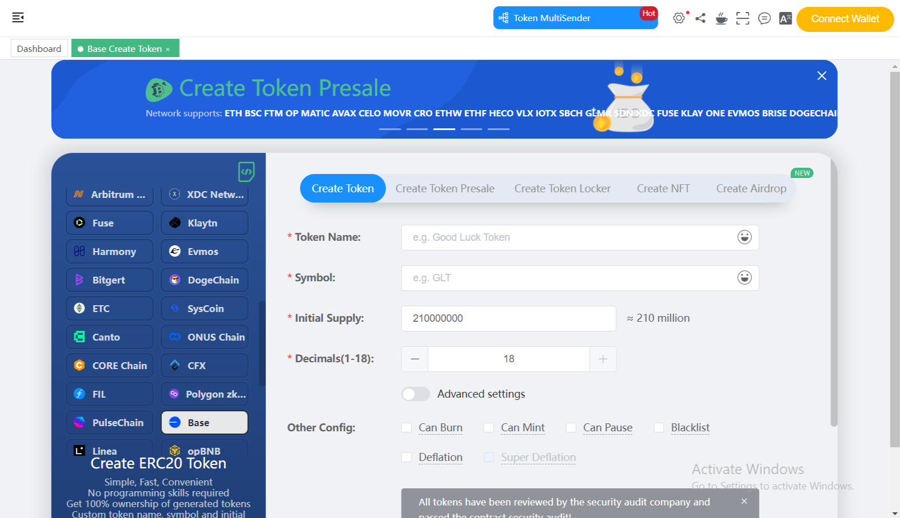
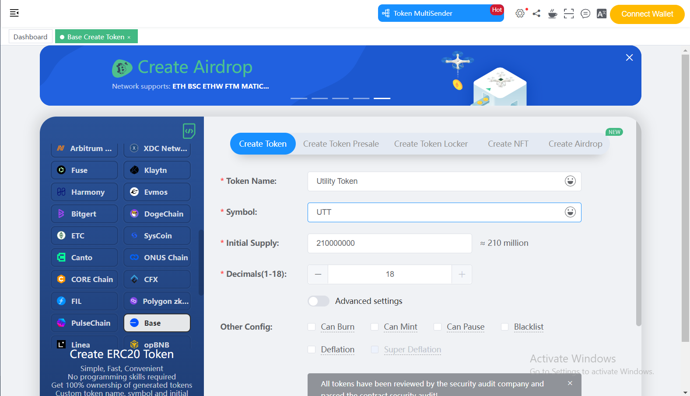
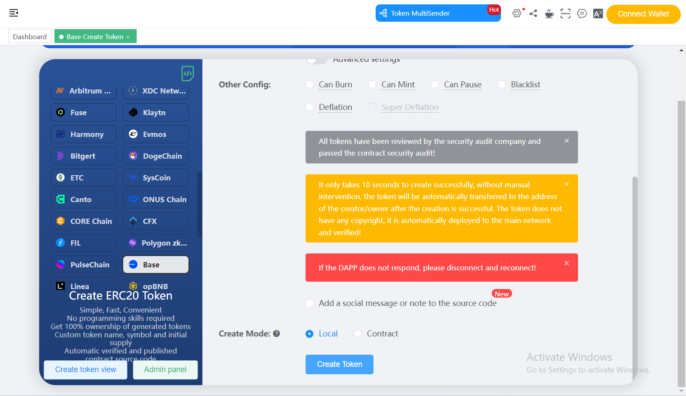

# How to launch a Utility Token for your Hive?

Each Hive has its utility token, which is utilized for leveraging tokenomics, facilitating governance and payments, distributing rewards, and incentivizing the creation of assets within its ecosystem.

## Prerequisites
1. Your token should be compliant with ERC20, ERC1363, EIP2612, and EIP3009 Standards.

## Instructions using Remix
**These instructions include our implementation of ERC20 which fulfills all standards mentioned above**

1. Open [Code in remix](https://remix.ethereum.org/?#code=<need to add base64 code here>)

2. Change the contract name from `YourToken` to whatever you wanna call your token.

3. Change the token name, token symbol, and token supply.

4. Navigate to `Deploy and run transactions` from the left navigation.

5. Change the environment from Remix VM to Injected Provider. And connect your Metamask.

6. Select the token contract to deploy.

7. Click on **Deploy** and approve the transaction in Metamask.

8. Congratulations you have deployed ERC20 token for your hive.

## Instructions

1. Open https://cointool.app/createToken/base
2. Connect your wallet using **Connect Wallet** button

    

3. Add details of your token such as **Token Name**, **Symbol**, **Initial Supply**, and **Decimals**

    

4. Click "Create Token" and approve the transaction in MetaMask

    
