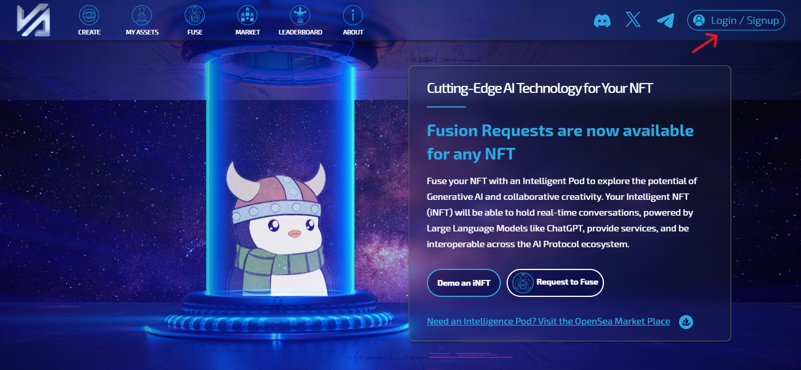
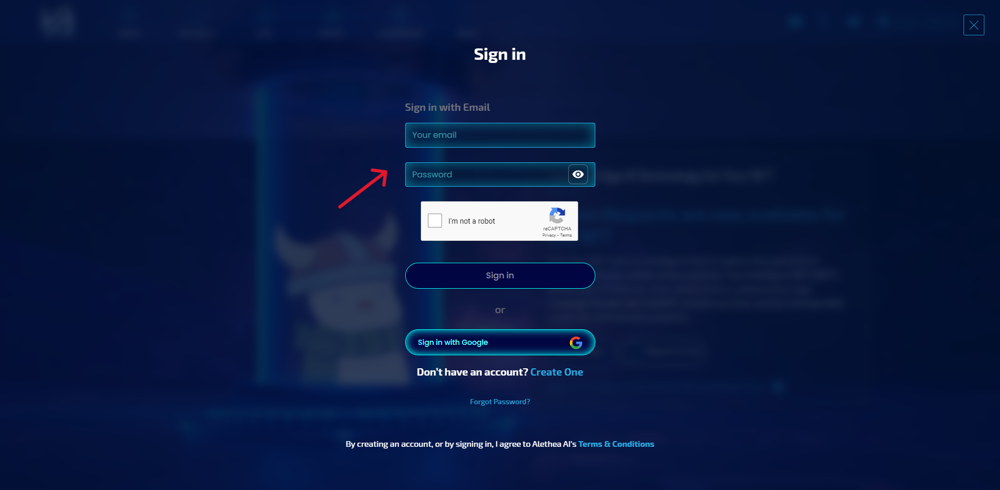
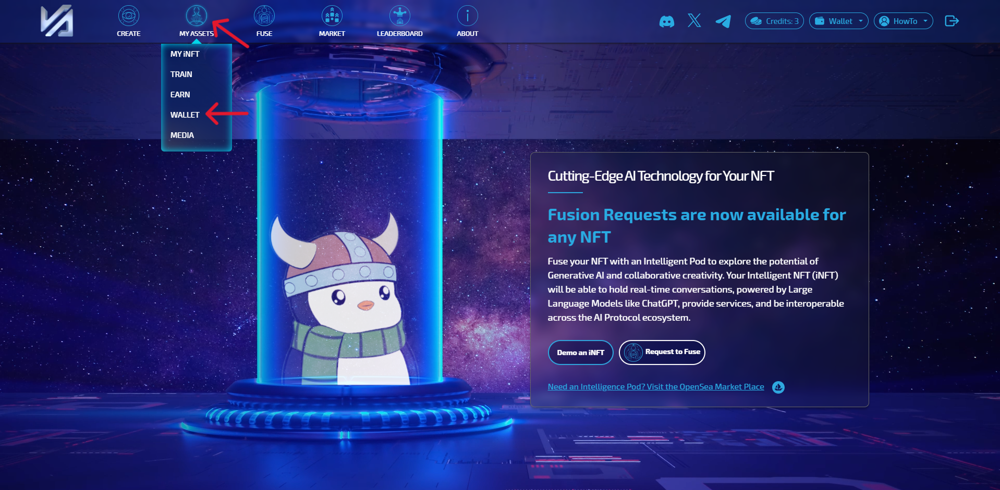
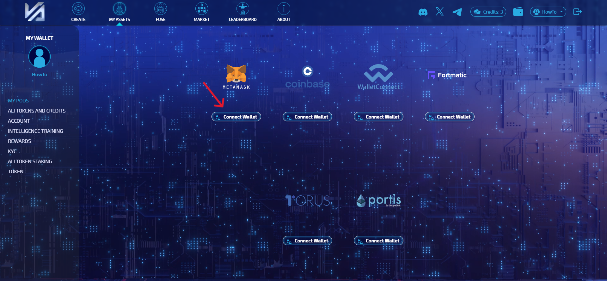
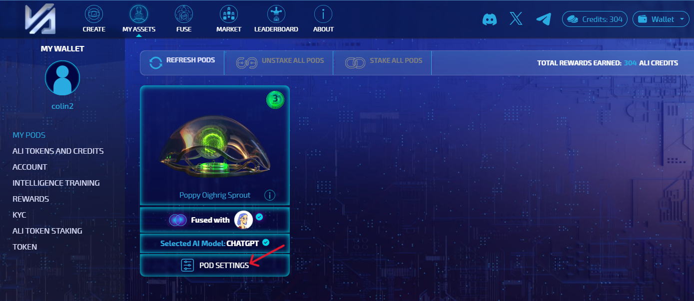
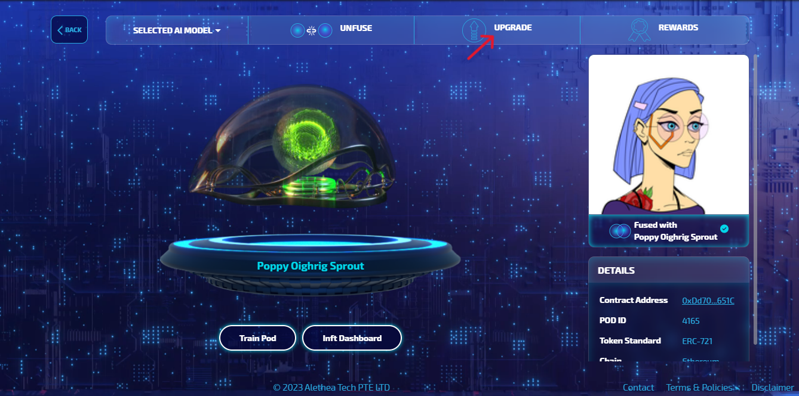
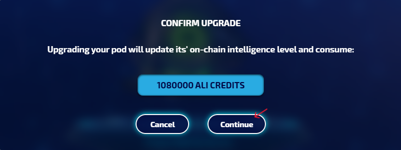

# How to Upgrade the Intelligence Level of an Intelligence Pod?

Upgrading the Intelligence Level of an Intelligence Pod is a straightforward process that directly impacts the capabilities and functionalities of iNFTs within the AI Protocol ecosystem. The core principle behind this upgrade is the locking of ALI Tokens into the Intelligence Pod, which dictates the Pod's Intelligence Level. This mechanism ensures that the higher the ALI Tokens locked, the higher the Intelligence Level the Pod can achieve, enabling the associated iNFT to access more advanced and powerful AI Services. The process begins at a base level of 1, with each subsequent level requiring more ALI Tokens to unlock further intelligence capabilities. This tiered approach allows iNFT owners to progressively enhance the intelligence of their digital assets, tapping into a broader spectrum of AI-driven functionalities and services provided by Noah's Ark AI Engine.

This structured approach simplifies the upgrade process and maintains the AI Protocol's commitment to a non-custodial, user-empowered framework. It illustrates a dynamic ecosystem where the utility of AI and token economics converge, offering a tangible avenue for iNFT owners to invest in and elevate their digital assets' intelligence, thereby unlocking new levels of interaction and value within the AI Protocol.

## Instructions using Noah's Ark

1. Open [noahsark.ai](https://noahsark.ai/)

2. Click Login / Signup to proceed
    
    

3. Sign In or Sign Up using your email

    

4. Select “Wallet” in the “My Assets” dropdown menu on the Nav bar.

    

5. Connect the wallet with the Intelligence Pod in it.

     

6. Click on “Pod Settings” under the Intelligence Pod you want to upgrade.

    

7. Click “Upgrade” button over the Pod 

    

8. Confirm that you want to upgrade your Pod to the next Level

    